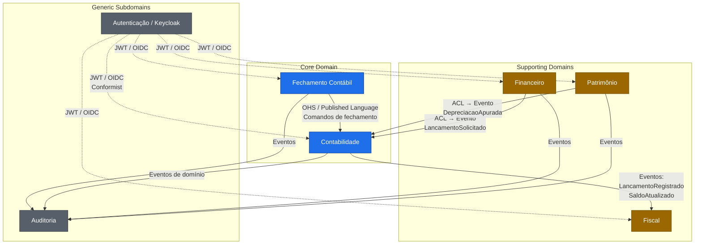

# SCGE — Strategic Design (DDD)

> Sistema Contábil Gerencial Empresarial. Documento estratégico (DDD Strategic Design):
> definição dos Bounded Contexts, Context Map, relacionamentos e responsabilidades.
> Foco deste workspace: **Bounded Context Contabilidade**.

---

## 1. Visão Geral

O SCGE é um sistema contábil corporativo modular, com suporte **dual**:

- **Contabilidade Pública** — aderente ao **MCASP** (Manual de Contabilidade Aplicada
  ao Setor Público), plano de contas **PCASP**, integrações com **SICONFI/SIAFI**.
- **Contabilidade Privada** — aderente aos **CPCs** (Comitê de Pronunciamentos
  Contábeis), integrações **SPED Contábil (ECD)** e **SPED Fiscal (EFD)**.

O regime contábil, plano de contas e perfil fiscal são definidos **por empresa**,
o que torna o domínio genérico com **perfis plugáveis** via *Strategy* e
*Specification Pattern*.

### 1.1. Princípios Norteadores

| Princípio | Aplicação |
|-----------|-----------|
| DDD Estratégico | BCs com modelo, linguagem e banco próprios. |
| Clean / Hexagonal | Domínio puro, sem dependência de framework. |
| Domínio rico | Invariantes dentro dos agregados; zero anemia. |
| Eventual Consistency | Comunicação entre BCs por **eventos de domínio**. |
| Auditabilidade total | Append-only em lançamentos; *event log* imutável. |
| Idempotência | `correlationId` + tabela de deduplicação em todo consumer. |
| API First | Contratos OpenAPI antes do código. |
| Outbox Pattern | Garantia transacional entre estado e evento. |

---

## 2. Bounded Contexts

Sete BCs compõem o ecossistema SCGE. Cada um possui **modelo de domínio próprio**,
**schema PostgreSQL próprio** (mesmo cluster físico, isolamento lógico) e **APIs próprias**.

| # | Bounded Context | Responsabilidade Nuclear | Tipo |
|---|-----------------|--------------------------|------|
| 1 | **Contabilidade** | Plano de contas, lançamentos contábeis, partidas dobradas, livros, balancetes, balanço, DRE. | **Core Domain** |
| 2 | **Fechamento Contábil** | Apuração de resultado, transferência de saldos, bloqueio de períodos, virada de exercício. | **Core Domain** |
| 3 | **Patrimônio** | Bens, imobilizado, depreciação, reavaliação, baixa. | Supporting |
| 4 | **Financeiro** | Contas a pagar/receber, tesouraria, conciliação bancária. | Supporting |
| 5 | **Fiscal** | Apuração de tributos, geração de SPED (ECD/EFD), SICONFI. | Supporting |
| 6 | **Auditoria** | Trilha imutável, *event log*, queries forenses, LGPD. | Generic |
| 7 | **Autenticação** | Identidade, RBAC, tenants, multiempresa, Keycloak. | Generic |

> **Core Domain** = onde mora a vantagem competitiva e a complexidade essencial.
> **Supporting** = necessário, mas não diferenciador.
> **Generic** = pronto-para-uso (preferimos integrar a IDP, não construir do zero).

---

## 3. Context Map



### 3.1. Padrões de Relacionamento (DDD)

| Origem → Destino | Padrão | Justificativa |
|---|---|---|
| Financeiro → Contabilidade | **Customer/Supplier** + **ACL** | Financeiro é cliente. Contabilidade publica *Published Language* (evento canônico de lançamento). ACL no Financeiro traduz seu modelo. |
| Patrimônio → Contabilidade | **Customer/Supplier** + **ACL** | Depreciação gera lançamento. Mesma estratégia. |
| Fechamento → Contabilidade | **Open Host Service** | Fechamento orquestra comandos via API REST exposta pela Contabilidade. |
| Contabilidade → Fiscal | **Published Language** | Contabilidade publica eventos de saldo; Fiscal consome para SPED/SICONFI. |
| Todos → Auditoria | **Published Language** (eventos) | Auditoria é *event-driven sink*. |
| Autenticação → Todos | **Conformist** | Todos os BCs aceitam o contrato JWT/OIDC do Keycloak. |

### 3.2. Direção das Dependências

> **Contabilidade não conhece nenhum outro BC.** Ela apenas publica seu domínio.
> Quem precisa de seus dados consome eventos ou chama suas APIs.

---

## 4. Estratégia de Persistência

- **Um schema PostgreSQL por BC** (`scge_contabilidade`, `scge_financeiro`, …).
- Sem joins entre schemas — comunicação obrigatoriamente por API ou evento.
- Cada BC tem seu **Flyway** independente, baseline `V1__init.sql`.

---

## 5. Estratégia de Eventos

- **Broker primário**: RabbitMQ (topology *topic exchange* por BC).
- **Broker secundário** (futuro): Kafka — apenas para *event log* da Auditoria
  e domínios com alta volumetria.
- **Outbox Pattern** obrigatório: evento é gravado na mesma transação do
  agregado; *relay* publica posteriormente. Garante *at-least-once* + idempotência.
- **Envelope canônico**:

```json
{
  "eventId": "uuid",
  "eventType": "contabilidade.lancamento.registrado.v1",
  "occurredOn": "2026-05-15T10:00:00Z",
  "tenantId": "uuid",
  "correlationId": "uuid",
  "causationId": "uuid",
  "version": 1,
  "payload": { }
}
```

---

## 6. Multitenancy & Multiexercício

- **Tenant** = Empresa (CNPJ/Ente). Discriminador `tenant_id` em **toda** tabela.
- **Exercício** = ano contábil. Discriminador `exercicio` em tabelas transacionais.
- Filtros aplicados via **Hibernate Filter** + interceptor JPA, alimentados pelo
  `TenantContext` (ThreadLocal preenchido por filtro Spring Security a partir do JWT).
- Estratégia: **Discriminator Column** (não schema-per-tenant) — equilibra
  isolamento e operação. Migração para schema-per-tenant é possível sem alterar
  domínio (apenas infra).

---

## 7. Visão Modular Sugerida (Maven)

```
scge/                                  (parent POM, futura agregação)
├── modulo_scge/                       ← este workspace (Contabilidade)
├── modulo_financeiro/
├── modulo_patrimonio/
├── modulo_fiscal/
├── modulo_fechamento/
├── modulo_auditoria/
└── shared-kernel/                     (eventos canônicos, VOs compartilhados mínimos)
```

> **Shared Kernel mínimo**: apenas `EventEnvelope`, `Money`, `Cnpj`, `TenantId`,
> `Periodo` — abstrações que **toda** organização concorda. Nada de regra de negócio.

---

## 8. Próximos Passos

1. ✅ Strategic Design (este documento + ubiquitous language + C4 + ADRs).
2. ⏭ Modelagem tática do BC Contabilidade (agregados, VOs, eventos, invariantes).
3. ⏭ Scaffolding Maven do `modulo_scge`.
4. ⏭ Use case vertical: `RegistrarLancamentoContabil`.

---

### Referências cruzadas

- [02 — Linguagem Ubíqua](02-ubiquitous-language.md)
- [03 — Diagramas C4](03-c4-diagrams.md)
- [04 — Bounded Context Contabilidade](04-bounded-context-contabilidade.md)
- [ADR 0001 — Arquitetura Hexagonal](adr/0001-arquitetura-hexagonal.md)
- [ADR 0002 — Monolito Modular com Extração Futura](adr/0002-monolito-modular.md)
- [ADR 0003 — Plano de Contas Dual MCASP/CPC](adr/0003-plano-de-contas-dual.md)
- [ADR 0004 — Outbox Pattern para Eventos de Domínio](adr/0004-outbox-pattern.md)
