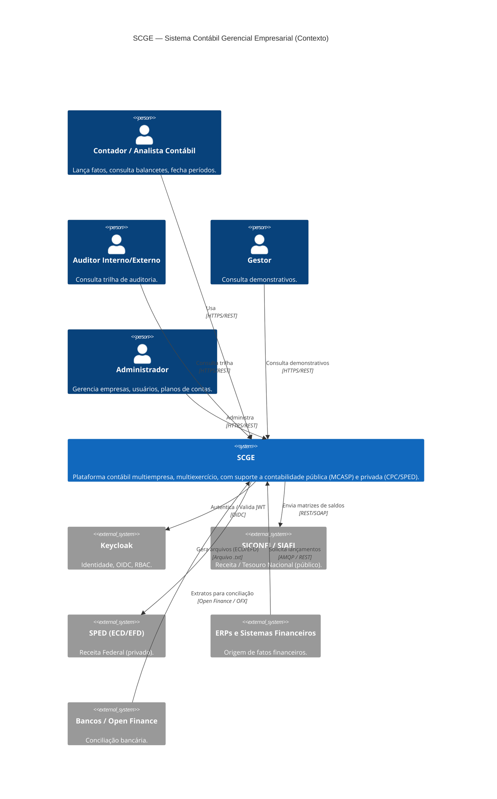
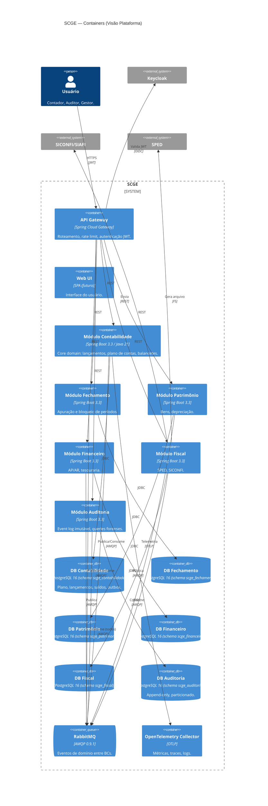
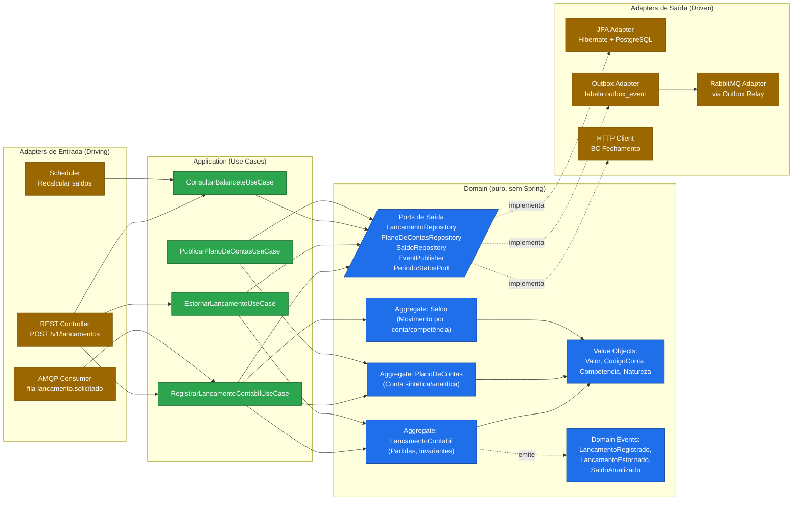

# SCGE — Diagramas C4

> Modelo C4 (Simon Brown). Níveis 1 (Sistema) e 2 (Containers) renderizados em Mermaid.
> Nível 3 (Componentes) será produzido por BC durante a modelagem tática.

---

## Nível 1 — Diagrama de Contexto do Sistema

---

## Nível 2 — Diagrama de Containers

---

## Nível 2.1 — Zoom no Módulo Contabilidade (Hexagonal)

### Regra de dependência
- `interfaces` → `application` → `domain`
- `infrastructure` → `application`/`domain` (implementa **ports**)
- **`domain` não depende de ninguém**, exceto Java SE.
