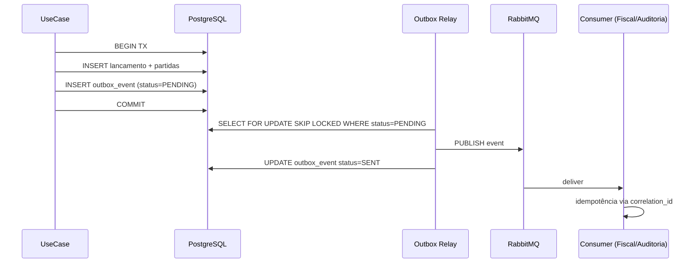

# ADR 0004 — Outbox Pattern para Eventos de Domínio

- **Status:** Aceito
- **Data:** 2026-05-15
- **Escopo:** Todos os BCs que publicam eventos. Especialmente crítico em Contabilidade.

## Contexto

Lançamentos contábeis publicam eventos consumidos por Fiscal, Patrimônio,
Auditoria. Existem dois problemas clássicos:

1. **Dual Write**: gravar no banco **e** publicar no broker não é atômico.
   Crash entre as operações gera inconsistência:
   - Caso A: salvou no banco, não publicou → BCs downstream ignoram o fato.
   - Caso B: publicou, não salvou → BCs reagem a fato inexistente.
2. **Ordering & Replay**: precisamos garantir ordem por agregado e capacidade
   de *replay* (rebuild de saldos, reprocessamento da Auditoria).

## Decisão

Adotar **Outbox Pattern** com **relay assíncrono**:



### Esquema da tabela `outbox_event`
```sql
CREATE TABLE outbox_event (
    id              UUID         PRIMARY KEY,
    aggregate_type  VARCHAR(80)  NOT NULL,
    aggregate_id    UUID         NOT NULL,
    event_type      VARCHAR(120) NOT NULL,
    event_version   SMALLINT     NOT NULL,
    payload         JSONB        NOT NULL,
    correlation_id  UUID         NOT NULL,
    causation_id    UUID,
    tenant_id       UUID         NOT NULL,
    occurred_on     TIMESTAMPTZ  NOT NULL,
    status          VARCHAR(16)  NOT NULL DEFAULT 'PENDING',
    attempts        SMALLINT     NOT NULL DEFAULT 0,
    last_error      TEXT,
    sent_at         TIMESTAMPTZ,
    created_at      TIMESTAMPTZ  NOT NULL DEFAULT now()
) PARTITION BY RANGE (created_at);

CREATE INDEX outbox_pending_idx
    ON outbox_event (created_at)
    WHERE status = 'PENDING';

CREATE INDEX outbox_aggregate_idx
    ON outbox_event (aggregate_type, aggregate_id);
```

### Relay
- Implementado como **scheduler Spring** (`@Scheduled`) com `SELECT FOR UPDATE SKIP LOCKED`
  para escala horizontal segura.
- Lote configurável (default 100).
- Backoff exponencial por `attempts`; após N tentativas, mover para `DLQ_OUTBOX`.
- *Alternativa futura*: **Debezium + Kafka Connect** (CDC) quando volume
  justificar — sem mudar o domínio.

### Consumidores: Idempotência Obrigatória
Tabela `processed_message` em cada BC consumidor:
```sql
CREATE TABLE processed_message (
    correlation_id UUID NOT NULL,
    event_type     VARCHAR(120) NOT NULL,
    processed_at   TIMESTAMPTZ NOT NULL DEFAULT now(),
    PRIMARY KEY (correlation_id, event_type)
);
```

## Alternativas Consideradas

| Alternativa | Por que não |
|-------------|-------------|
| Publicar direto após commit (`@TransactionalEventListener AFTER_COMMIT`) | Falha se o processo morrer entre commit e publish. |
| 2PC / XA | Complexidade operacional altíssima; broker não suporta confiavelmente. |
| Event Sourcing puro | Adequado para o futuro; intrusivo demais agora. |
| Debezium / CDC desde o início | Operação extra (Kafka Connect cluster); avaliaremos quando justificar. |

## Consequências

### Positivas
- Atomicidade lógica entre estado e evento.
- *At-least-once* garantido; consumers idempotentes neutralizam duplicidade.
- *Replay* trivial (re-publicar `outbox_event`).

### Negativas
- Latência adicional (poll-based, ~1s configurável).
- Custo de armazenamento (mitigado por particionamento + archive após N dias).

### Riscos
- Crescimento descontrolado da tabela. **Mitigação:** particionamento + job de archive.
- Relay parado. **Mitigação:** *liveness* + alerta de idade do `PENDING` mais antigo (SLO).
